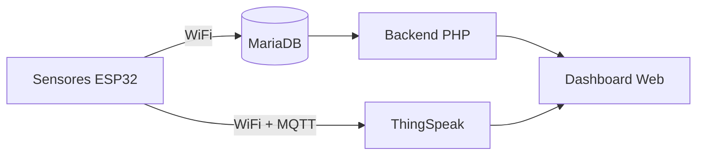
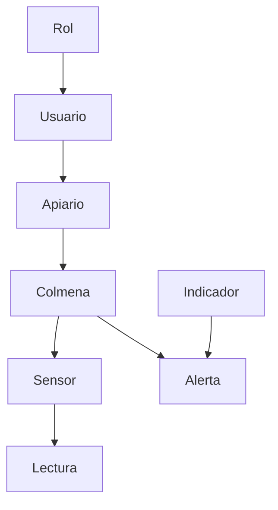

<div align="center">


</div>

Sistema de monitoreo apícola no invasivo con IoT. Un ESP32 recolecta temperatura, humedad, peso, sonido y calidad del aire de una colmena en tiempo real, sin necesidad de abrir el panal.

Proyecto de formación — SENA, Centro Minero Ambiental, El Bagre (Antioquia).


---

## Cómo funciona

Los sensores del ESP32 envían las lecturas por WiFi + MQTT a ThingSpeak, y en paralelo a una base de datos MariaDB. Un backend en PHP sirve esos datos a un dashboard web donde se visualizan colmenas, sensores y alertas.




## Características

- Monitoreo en tiempo real: temperatura y humedad (DHT22), peso (HX711), acústica (MAX9814), calidad del aire (MQ-135)
- Panel de energía del sistema de sensores en campo
- Dashboard con vistas de resumen, dispositivos, sensores, acústica, peso y energía
- Integración con ThingSpeak para histórico y tendencias
- Prototipo físico: carcasa hexagonal impresa en 3D

## Stack


## Instalación

```bash
git clone https://github.com/jeronimoparra-ai/BeeStation_Sena.git
```

1. Mover el proyecto a `htdocs` de XAMPP
2. Importar `database/beestation_schema.sql` en phpMyAdmin
3. Configurar credenciales de MariaDB en el backend PHP
4. Cargar el firmware en el ESP32 (SSID, contraseña WiFi, canal MQTT de ThingSpeak)
5. Iniciar Apache + MariaDB y entrar a `http://localhost/BeeStation`

**Requisitos:** [XAMPP](https://www.apachefriends.org/), [Arduino IDE](https://www.arduino.cc/en/software) con soporte ESP32, cuenta en [ThingSpeak](https://thingspeak.com/)

## Roadmap

- [x] Modelo entidad-relación (12 entidades) y esquema SQL simplificado (8 tablas)
- [x] Prototipo de interfaz en Figma y prototipo físico impreso en 3D
- [x] Conexión ESP32 vía MQTT + dashboard web funcional
- [x] Estrategia de actualización OTA definida
- [ ] Implementación de OTA en campo
- [ ] Detección de enjambrazón con IA
- [ ] Conectividad LoRa
- [ ] Reporte académico completo

<details>
<summary>Equipo e institución</summary>
<br>

**Centro de formación:** Centro Minero Ambiental (CFMA) - SENA, El Bagre, Antioquia
**Instructor:** Farley González
**Programa:** Técnico en Programación de Software

**Equipo:** Andrés Jerónimo Parra, Diego Noriega Vega, Samuel Montoya Suárez, Edwin Segundo Camacho

</details>

<details>
<summary>Estructura de la base de datos</summary>
<br>



El modelo completo se diseñó en notación Chen con 12 entidades. La implementación usa un esquema simplificado de 8 tablas (`database/beestation_schema.sql`), con relaciones FK y un ajuste de nombre para evitar la palabra reservada `precision` (renombrada `sensor_precision`).

</details>

## Licencia

MIT — ver [LICENSE](./LICENSE)
w