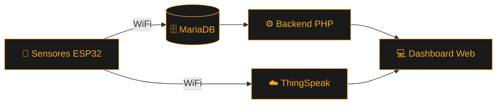
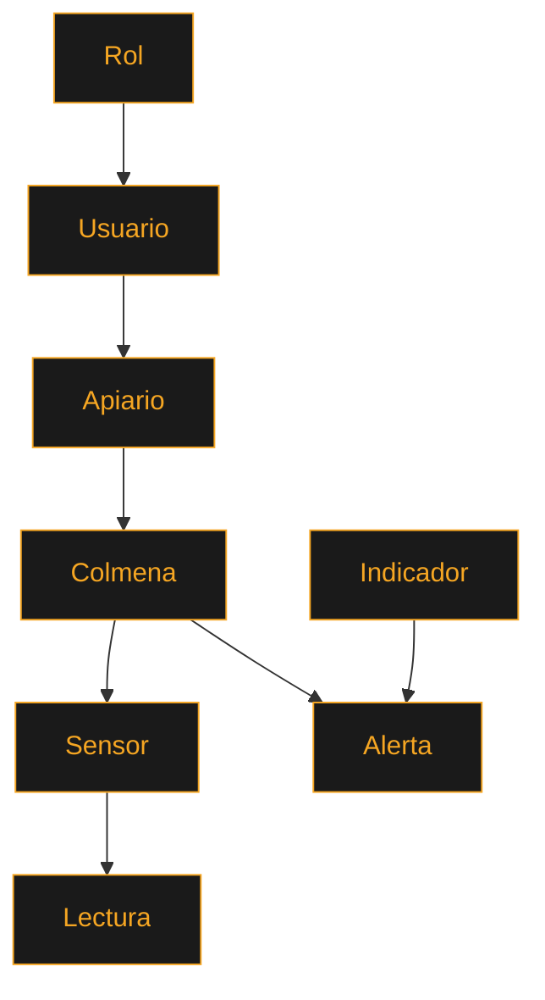

<div align="center">


[](https://git.io/typing-svg)

<br>


</div>

<br>

<p align="center">
  
</p>

## 📋 Tabla de contenido

- [Acerca del proyecto](#-acerca-del-proyecto)
- [Institución académica](#-institución-académica)
- [Equipo de desarrollo](#-equipo-de-desarrollo)
- [Características](#-características)
- [Arquitectura del sistema](#-arquitectura-del-sistema)
- [Stack tecnológico](#-stack-tecnológico)
- [Estructura de la base de datos](#-estructura-de-la-base-de-datos)
- [Instalación](#-instalación)
- [Hoja de ruta](#-hoja-de-ruta)
- [Licencia](#-licencia)

<br>

## 🐝 Acerca del proyecto

**BeeStation** es un sistema de monitoreo apícola no invasivo basado en Internet de las Cosas (IoT). Utiliza sensores conectados a un microcontrolador **ESP32** para recolectar en tiempo real variables críticas de las colmenas —temperatura, humedad, peso, sonido y consumo energético— sin necesidad de abrir o intervenir físicamente el panal.

La información recolectada se transmite a **ThingSpeak** para su visualización y análisis, y se integra con un panel de control propio (dashboard web) desarrollado en HTML, CSS y PHP sobre una base de datos MariaDB, pensado para que apicultores y estudiantes puedan tomar decisiones informadas sobre la salud y productividad de sus colmenas.

El proyecto nace como iniciativa de formación en el **Centro Minero Ambiental (CFMA)** del SENA en El Bagre, Antioquia, articulando electrónica, desarrollo de software y sostenibilidad ambiental.

<br>

## 🏫 Institución académica

<div align="center">

| | |
|---|---|
| 🏢 **Centro de formación** | Centro Minero Ambiental (CFMA) - SENA |
| 📍 **Ubicación** | El Bagre, Antioquia, Colombia |
| 👨‍🏫 **Instructor** | Farley González |
| 🎓 **Programa** | Técnico en Programación de Software |

</div>

<br>

## 👥 Equipo de desarrollo

<div align="center">

| Integrante |
|---|
| 🐝 Andrés Jerónimo Parra |
| 🐝 Diego Noriega Vega |
| 🐝 Samuel Montoya Suárez |
| 🐝 Edwin Segundo Camacho |

</div>

<br>

## ✨ Características

<table align="center">
<tr>
<td width="50%">

### 🌡️ Monitoreo en tiempo real
Sensores ESP32 capturan temperatura, humedad, peso y acústica de la colmena de forma continua.

### 🔋 Panel de energía
Seguimiento del consumo y estado energético del sistema de sensores en campo.

</td>
<td width="50%">

### 📊 Dashboard visual
Interfaz web con tarjetas informativas, pensada para lectura rápida de indicadores clave.

### ☁️ Integración con ThingSpeak
Visualización histórica y análisis de tendencias de los datos recolectados.

</td>
</tr>
</table>

<br>

## 🏗️ Arquitectura del sistema



<br>

## 🛠️ Stack tecnológico

<div align="center">


</div>

<br>

## 🗃️ Estructura de la base de datos

Jerarquía de entidades del modelo relacional:



<br>

## ⚙️ Instalación

### Requisitos previos

- [XAMPP](https://www.apachefriends.org/) (Apache + MariaDB + PHP)
- [Arduino IDE](https://www.arduino.cc/en/software) con soporte para ESP32
- Cuenta en [ThingSpeak](https://thingspeak.com/)

### Pasos

```bash
# 1. Clonar el repositorio
git clone https://github.com/jeronimoparra-ai/BeeStation_Sena.git

# 2. Mover el proyecto a la carpeta htdocs de XAMPP
# (en Windows) C:\xampp\htdocs\

# 3. Importar el esquema de base de datos en phpMyAdmin
# Archivo: /database/beestation.sql

# 4. Configurar credenciales de conexión
# Editar el archivo de configuración PHP con tus datos de MariaDB

# 5. Cargar el firmware en el ESP32 desde Arduino IDE
# Configurar SSID, contraseña WiFi y canal de ThingSpeak

# 6. Iniciar Apache y MariaDB desde el panel de XAMPP
# Acceder al dashboard en http://localhost/BeeStation
```

<br>

## 🗺️ Hoja de ruta

- [x] Diseño del modelo entidad-relación
- [x] Conexión inalámbrica del ESP32
- [x] Dashboard web (login, resumen, dispositivos, sensores, acústica, peso, energía)
- [ ] Detección de enjambrazón con inteligencia artificial
- [ ] Conectividad LoRa para zonas rurales sin cobertura WiFi
- [ ] Reporte académico completo (justificación, metodología, cronograma, presupuesto)

<br>

## 📄 Licencia

Este proyecto está bajo la licencia MIT. Consulta el archivo [LICENSE](./LICENSE) para más detalles.

<br>

<div align="center">


**Hecho con 🐝 en El Bagre, Antioquia — SENA, Centro Minero Ambiental**

</div>