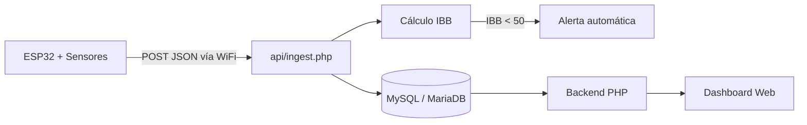
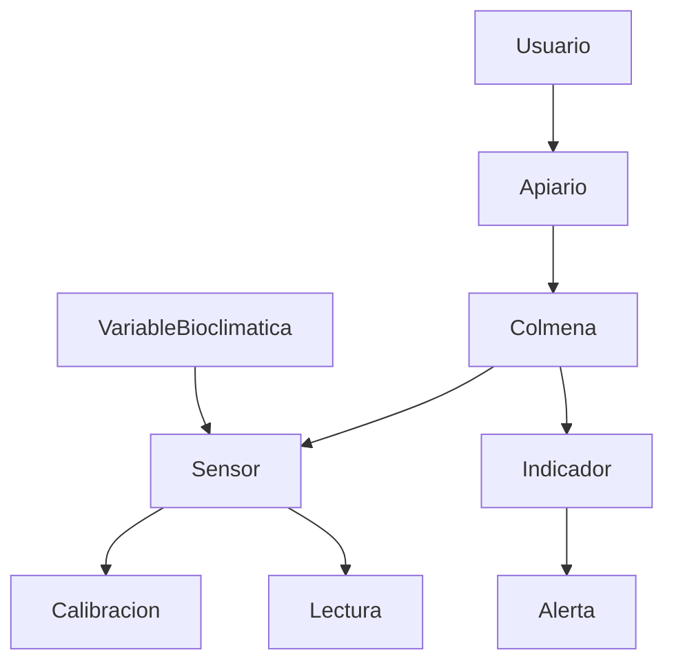

<div align="center">


</div>

Sistema de monitoreo apícola no invasivo con IoT. Un ESP32 recolecta temperatura, humedad, peso, sonido y calidad del aire de una colmena en tiempo real, sin necesidad de abrir el panal.

Proyecto de formación — SENA, Centro Minero Ambiental, El Bagre (Antioquia).


---

## Cómo funciona

El ESP32 con los sensores envía cada lectura por WiFi directamente al backend en PHP mediante una petición **HTTP POST en JSON** — sin intermediarios como MQTT o ThingSpeak. El backend valida el sensor, aplica el factor de calibración, guarda en MySQL/MariaDB y recalcula el Índice de Bienestar Bioclimático (IBB) en cada ingesta.



## Características

- Monitoreo en tiempo real: temperatura interna/externa y humedad (DHT22), peso (HX711), acústica (MAX9814, banda 400–600 Hz para pre-enjambrazón), calidad del aire/CO₂ (MQ-135)
- Envío de datos exclusivamente por HTTP POST directo del ESP32 a `api/ingest.php` — sin MQTT ni servicios externos
- Cálculo automático del IBB en cada ingesta, ponderado: temperatura 45% + humedad 35% + CO₂ 20%
- Generación automática de alertas cuando el IBB cae por debajo de 50
- Dashboard con vistas de Resumen, Dispositivos, Sensores, Acústica, Peso y Energía, todas conectadas a datos reales
- Cero datos ficticios: sin lecturas, cada vista muestra un estado vacío explícito en vez de inventar números
- Prototipo físico: carcasa hexagonal impresa en 3D

## Stack


## Instalación

```bash
git clone https://github.com/jeronimoparra-ai/BeeStation_Sena.git
```

1. Copia el proyecto a `htdocs` de XAMPP (o el directorio público de tu servidor)
2. Importa `database/schema.sql` en phpMyAdmin — crea la base `beestation_sena`, todas las tablas y una colmena de ejemplo (Alpha-01) con sus 6 sensores, sin lecturas falsas
3. Configura las credenciales de MySQL en `config/db.php` (`DB_HOST`, `DB_NAME`, `DB_USER`, `DB_PASS`)
4. Genera el hash real de la contraseña del usuario admin con `password_hash()` y reemplázalo en la tabla `usuario` — el valor que trae `schema.sql` es un placeholder que no funciona (pasos detallados en `README.txt`)
5. Carga el firmware en el ESP32 (SSID, contraseña WiFi, IP del servidor y `ID_COLMENA`) apuntando a `api/ingest.php` — código Arduino de ejemplo en `README.txt`
6. Inicia Apache + MySQL y entra a `http://localhost/BeeStation`

**Requisitos:** PHP 8+ con extensión PDO MySQL, MySQL/MariaDB, [XAMPP](https://www.apachefriends.org/) (u equivalente), [Arduino IDE](https://www.arduino.cc/en/software) con soporte para ESP32.

No se necesita cuenta en ningún servicio externo — todo el flujo de datos corre en tu propio servidor.

## Roadmap

**Completado (con evidencia real):**
- [x] Modelo entidad-relación (notación Chen, 12 entidades) y esquema SQL implementado en `database/schema.sql`
- [x] Prototipo físico impreso en 3D (carcasa hexagonal)
- [x] Backend PHP + MySQL funcional, dashboard sirviendo datos reales (sin valores de relleno)
- [x] Endpoint `api/ingest.php` operativo: valida sensor, calibra, guarda lectura y recalcula el IBB automáticamente
- [x] Bloqueador de MySQL local en XAMPP — resuelto

**🔴 Bloqueador activo:**
- [ ] Carga de firmware al ESP32 por USB — posible cable sin líneas de datos, sin puerto COM detectado en Windows. Bloquea cualquier prueba con hardware real
- [ ] Ruta OTA sin confirmar — requiere firmware previo cargado por USB con `ArduinoOTA` activo, no verificado en el código actual

**Indicadores bioclimáticos pendientes** (fórmulas definidas, sin implementar):
- [ ] IRE — Índice de Riesgo de Enjambrazón
- [ ] EV — Eficiencia de Ventilación
- [ ] ΔT — Diferencial de temperatura interior/exterior
- [ ] H_miel — Humedad estimada de la miel
- [ ] FN — Flujo de Néctar (existe `calcularFlujoDiarioPeso()`, falta formalizarlo como indicador insertado en la tabla `indicador`)

**Hardening y bugs conocidos:**
- [ ] Autenticación por API key en `api/ingest.php` (hoy cualquiera con la URL puede enviar datos)
- [ ] Registrar el sensor de energía (`energia`, INA219) en `schema.sql`
- [ ] Depurar por completo el sistema de roles del esquema (tabla `rol` y FK `usuario.id_rol` siguen presentes pese a la decisión de eliminarlos)
- [ ] Persistir las alertas de enjambrazón (`acustica.php` las calcula pero nunca las inserta en `alerta`)

**Sin iniciar:**
- [ ] Detección de enjambrazón con IA
- [ ] Conectividad LoRa para apiarios sin cobertura WiFi
- [ ] Reporte académico completo

<details>
<summary>Equipo e institución</summary>
<br>

**Centro de formación:** Centro Minero Ambiental (CFMA) - SENA, El Bagre, Antioquia
**Instructor:** Farley González
**Programa:** Técnico en Programación de Software
**Ficha:** 3412544

**Equipo:** Andrés Jerónimo Parra Bastidas, Diego Noriega Vega, Samuel Montoya Suárez, Edwin Segundo Camacho

</details>

<details>
<summary>Estructura de la base de datos</summary>
<br>



El sistema de roles (`rol`, `usuario.id_rol`) fue eliminado del diseño: todos los usuarios autenticados tienen el mismo nivel de acceso. **Nota:** la tabla `rol` y la FK `usuario.id_rol` todavía existen físicamente en `database/schema.sql` — limpieza pendiente (ver Roadmap). Por eso el esquema real hoy tiene 10 tablas en vez de las 9 que corresponden al diseño ya decidido.

El modelo completo se diseñó en notación Chen con 12 entidades; la implementación actual usa este esquema simplificado en `database/schema.sql`. El campo de precisión del sensor se llama `precision_valor` (se evitó la palabra reservada `precision`).

</details>

## Licencia

MIT — ver [LICENSE](./LICENSE)
