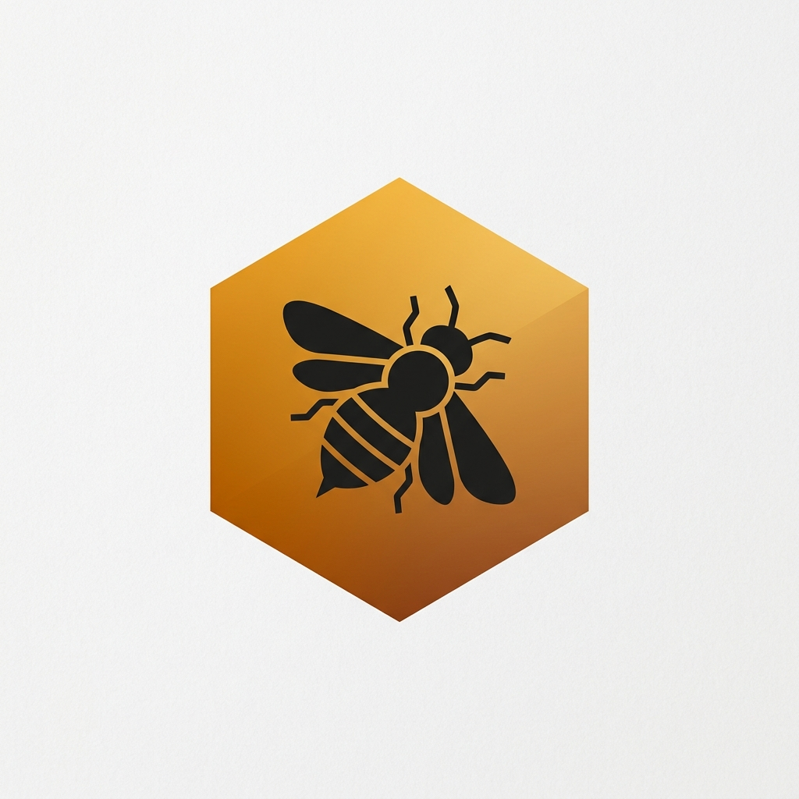
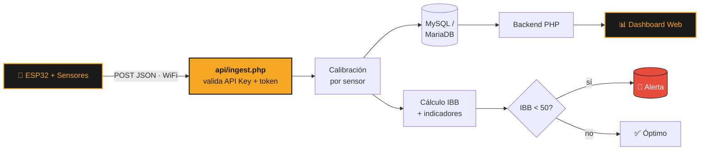
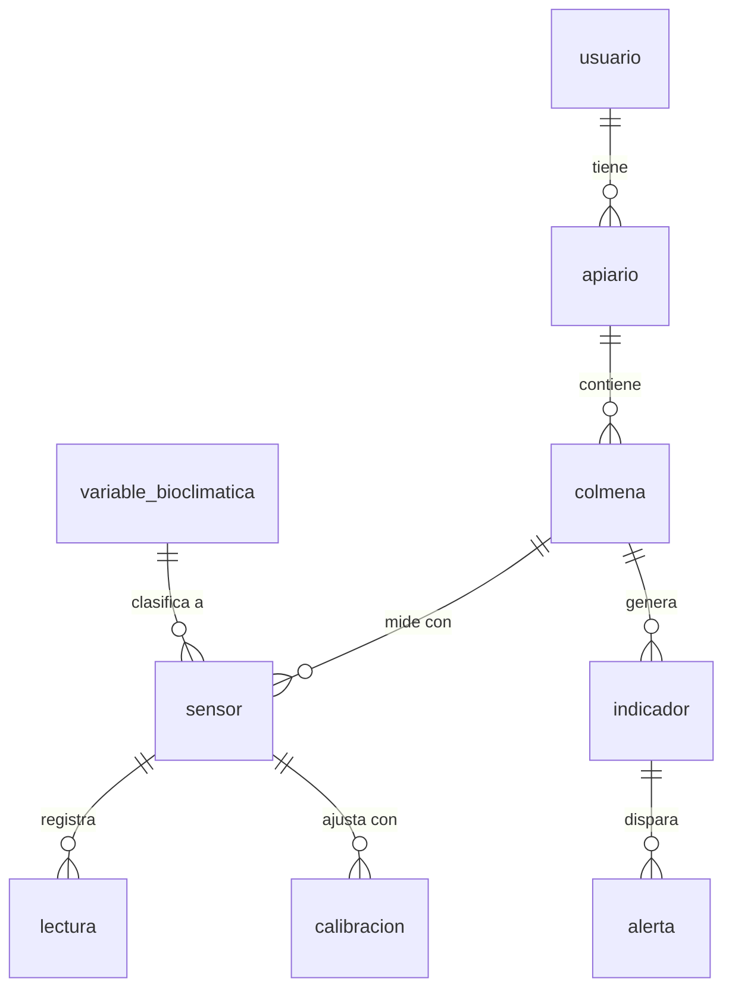

<div align="center">



# 🐝 BeeStation

**Monitoreo apícola no invasivo con IoT**
*Un ESP32 escucha la colmena sin abrirla: temperatura, humedad, peso, acústica y calidad del aire en tiempo real.*

<br>


<br>

[**Cómo funciona**](#-cómo-funciona) •
[**Hardware**](#-hardware) •
[**API**](#-api) •
[**Instalación**](#-instalación) •
[**Roadmap**](#-roadmap)

<br>
</div>

---

## 📖 Qué es

BeeStation es un sistema de vigilancia de colmenas que **no requiere abrir el panal**. Un módulo ESP32 con sensores montados sobre la colmena mide las condiciones del interior y las envía por WiFi a un backend propio en PHP, que las almacena, las evalúa contra umbrales bioclimáticos y dispara alertas.

> **Sin nube, sin cuentas, sin intermediarios.** Todo el flujo corre en tu propio servidor: el ESP32 hace `HTTP POST` directo a `api/ingest.php`. No hay MQTT, ni ThingSpeak, ni servicios de terceros.

Proyecto de formación — **SENA, Centro Minero Ambiental**, El Bagre (Antioquia).

---

## 🏗️ Cómo funciona


```mermaid
flowchart LR
    A["🐝 ESP32 + Sensores"] -->|"POST JSON · WiFi"| B["<b>api/ingest.php</b><br/>valida API Key + token"]
    B --> C["Calibración<br/>por sensor"]
    C --> D[(MySQL /<br/>MariaDB)]
    C --> E["Cálculo IBB<br/>+ indicadores"]
    E --> F{"IBB < 50?"}
    F -->|"sí"| G[("🔔 Alerta")]
    F -->|"no"| H["✅ Óptimo"]
    D --> I["Backend PHP"]
    I --> J["📊 Dashboard Web"]

    style A fill:#1a1a1a,stroke:#F5A623,color:#F5A623,stroke-width:2px
    style B fill:#F5A623,stroke:#1a1a1a,color:#1a1a1a,stroke-width:2px
    style G fill:#e74c3c,stroke:#1a1a1a,color:#fff
    style J fill:#1a1a1a,stroke:#F5A623,color:#F5A623,stroke-width:2px
```

<br>

| Paso | Qué ocurre |
|:--:|---|
| **1** | El ESP32 despierta, lee todos los sensores y arma el JSON |
| **2** | `POST` a `api/ingest.php` con `X-API-Key` + `token` de vinculación |
| **3** | El backend valida la clave (`hash_equals`) y que el token no esté revocado |
| **4** | Aplica el factor de calibración propio de cada sensor y guarda la lectura |
| **5** | Recalcula el **IBB** y los indicadores derivados en la misma ingesta |
| **6** | Evalúa los disparadores: **IBB < 50** y **enjambrazón acústico** (400–600 Hz) — si saltan, inserta la alerta (con ventana de supresión para no duplicar) |
| **7** | El dashboard refleja todo con datos reales — cero valores de relleno |

---

## ✨ Características

<table>
<tr>
<td width="50%">

### 🔴 Monitoreo en vivo
- Temperatura y humedad internas — **BME280**
- Presión barométrica — **BME280**
- Peso de la colmena — **HX711** (celda de carga)
- Acústica — **MAX4466**, banda **400–600 Hz** (señal de pre-enjambrazón)
- Luminosidad ambiente — **BH1750**
- Respaldo local en **microSD** antes de cada transmisión

</td>
<td width="50%">

### 🧠 Decisiones automáticas
- **IBB** recalculado en cada ingesta (45 % temp · 35 % humedad · 20 % CO₂)
- Umbrales por variable: **óptimo / alerta / crítico**
- **Dos alertas automáticas**: `IBB_BAJO` al bajar de 50 y `ENJAMBRAZON` en la banda 400–600 Hz
- Índices derivados: **ΔT**, **EV**, **H_miel**, flujo de néctar
- **Cero datos ficticios**: sin lecturas, la vista muestra estado vacío explícito

</td>
</tr>
<tr>
<td>

### 🔒 Seguridad
- **API Key** obligatoria en toda petición (`hash_equals`, sin *timing attack*)
- **Token de vinculación** único por colmena (`BS-XXXX-XXXX`)
- Control de intentos fallidos + revocación de token
- Credenciales fuera del código vía `config/db.php`

</td>
<td>

### 📡 Firmware autónomo
- **Portal cautivo** para aprovisionar WiFi desde el celular (`BeeStation_Config`)
- Persistencia en **NVS**: guarda credenciales y no vuelve a pedirlas
- **Reset de fábrica** sosteniendo el botón BOOT 3 s (borra la NVS)
- Reconexión con **backoff exponencial** y diagnóstico por puerto serie

</td>
</tr>
</table>

---

## 🔧 Hardware

**Placa:** ESP32 Dev Module · **Firmware:** `beestation_node/` v3.0.0

| Módulo | Modelo | Interfaz | Pines GPIO | Función |
|---|:-:|:-:|:-:|---|
| 🌡️ Clima | **BME280** | I²C | `SDA 21` · `SCL 22` | Temp., humedad y presión |
| 💡 Luz | **BH1750** | I²C | `SDA 21` · `SCL 22` *(bus compartido)* | Luminosidad en luxes |
| ⚖️ Peso | **HX711** | Digital | `DOUT 16` · `SCK 4` | Celda de carga 24 bits |
| 🎤 Sonido | **MAX4466** | ADC1 | `GPIO 35` | Micrófono analógico |
| 💾 Almacenamiento | **microSD** | VSPI | `CS 5` · `MOSI 23` · `MISO 19` · `SCK 18` | Log local de respaldo |
| 🔘 Reset | Botón BOOT | Digital | `GPIO 0` | Formatea la NVS a los 3 s |
| 💡 Estado | LED integrado | Digital | `GPIO 2` | Indicador de estado |

<details>
<summary><b>Requisitos del entorno de desarrollo</b></summary>
<br>

```bash
# Núcleo ESP32
arduino-cli core install esp32:esp32          # v3.3.12

# Bibliotecas (paso 2.1 de la guía técnica)
arduino-cli lib install \
  "Adafruit Unified Sensor" \
  "Adafruit BME280 Library" \
  "BH1750" \
  "HX711 Arduino Library"

# Verificar sin placa conectada
arduino-cli compile --fqbn esp32:esp32:esp32 beestation_node
```

> **Drivers USB:** los módulos `cp210x` y `ch341` ya vienen en el kernel de Linux. En Windows hay que instalar el driver CP210x o CH340 según tu placa.

</details>

---

## 📡 Sensores y umbrales

Cada colmena se crea con **7 sensores** precargados. Los umbrales viven en `variable_bioclimatica`:

| Variable | Unidad | ✅ Óptimo | ⚠️ Alerta | 🔴 Crítico |
|---|:-:|:-:|:-:|:-:|
| `temperatura_interna` | °C | 34 – 36 | 32 – 38 | 30 – 40 |
| `humedad_relativa` | %HR | 50 – 70 | 45 – 80 | 35 – 85 |
| `sonido` | Hz | 200 – 380 | 400 – 600 | 600 – 900 |
| `co2` | ppm | 2 000 – 4 000 | 1 000 – 6 000 | 500 – 10 000 |
| `presion` | hPa | 1 000 – 1 025 | 980 – 1 040 | 960 – 1 060 |
| `energia` | V | 3,7 – 4,2 | 3,0 – 4,2 | 2,8 – 4,2 |
| `peso` / `luz` | kg / lux | *sin umbral* | *monitoreo puro* | *monitoreo puro* |

---

## 🧮 Índice de Bienestar Bioclimático

Se recalcula en **cada ingesta**, a partir de tres factores normalizados:

```
IBB = 100 − ( 0,45 · f_temp + 0,35 · f_hum + 0,20 · f_co2 )
```

> ⚠️ **Nota:** la fórmula exige las tres variables. El backend calcula el IBB solo cuando existen lecturas de temperatura, humedad **y CO₂**; mientras el firmware no emita `co2`, el indicador queda en `null` *(ver [Roadmap](#-roadmap))*.

| IBB | Estado | Acción |
|:-:|---|---|
| **≥ 85** | 🟢 Óptimo | Sin alerta |
| **70 – 84** | 🔵 Bueno | Sin alerta |
| **50 – 69** | 🟡 Regular | Vigilancia |
| **30 – 49** | 🟠 Deficiente | **Alerta automática** |
| **< 30** | 🔴 Crítico | **Alerta automática** |

**Indicadores derivados también implementados:**

| Sigla | Nombre | Qué mide |
|:-:|---|---|
| **ΔT** | Diferencial térmico | Interior vs. exterior — si sube, la colmena se está ventilando |
| **EV** | Eficiencia de ventilación | Capacidad de la colonia de regular su clima |
| **H_miel** | Humedad de la miel | Estimada a partir de la HR interna (`12 + (HR − 40) · 0,35`) |
| **FN** | Flujo de néctar | Variación diaria de peso |

---

## 🌐 API

Tres endpoints, todos en `api/`. **Toda petición necesita el header `X-API-Key`.**

| Método | Ruta | Descripción |
|:-:|---|---|
| `GET` | `api/ping.php` | Salud del servicio |
| `POST` | `api/validate_token.php` | Comprueba que el token de vinculación sea válido y no esté revocado |
| `POST` | `api/ingest.php` | Recibe lecturas, calibra, guarda y recalcula el IBB |

<br>

<details>
<summary><b>▸ Ejemplo: ingestión de lecturas</b></summary>
<br>

```bash
curl -X POST http://localhost/BeeStation_Sena/api/ingest.php \
  -H 'Content-Type: application/json' \
  -H 'X-API-Key: <BEESTATION_API_KEY>' \
  -d '{
    "token": "BS-ALPHA01-1A2B3C",
    "lecturas": [
      { "tipo": "temperatura_interna", "valor": 34.5 },
      { "tipo": "humedad_relativa",    "valor": 62.0 },
      { "tipo": "co2",                 "valor": 2800 },
      { "tipo": "peso",                "valor": 18.7 },
      { "tipo": "sonido",              "valor": 312.0 }
    ]
  }'
```

```json
{
  "ok": true,
  "colmena": "Alpha-01",
  "insertados": ["temperatura_interna", "humedad_relativa", "co2", "peso", "sonido"],
  "errores": [],
  "ibb_calculado": { "valor": 87.7, "estado": "Óptimo" },
  "delta_t": null,
  "ev": { "valor": 93.3, "estado": "Excelente" },
  "h_miel": { "valor": 19.7, "estado": "Cerca de madurar" }
}
```

*Respuesta reproducida de la implementación real (`api/ingest.php:211`). `delta_t` queda en `null` porque no se envió `temperatura_externa`; `ev` sí se calcula porque la fórmula de ventilación solo exige `co2`.*

</details>

<details>
<summary><b>▸ Códigos de estado</b></summary>
<br>

| Código | Causa |
|:-:|---|
| `200` | Ingesta correcta |
| `401` | API Key inválida o ausente |
| `400` | Token desconocido / revocado, o JSON malformado |
| `405` | Método distinto de `POST` |

</details>

---

## 🖥️ Dashboard

| Vista | Ruta | Qué muestra |
|---|---|---|
| 📊 Resumen | `dashboard.php` | IBB actual, estado de la colonia y alertas recientes |
| 📱 Dispositivos | `dispositivos.php` | Registro de colmenas, generación de tokens y estado de conexión |
| 🌡️ Sensores | `sensores.php` | Todas las variables en vivo con su rango y estado |
| 🎵 Acústica | `acustica.php` | Análisis de banda y detección de enjambrazón |
| ⚖️ Peso | `peso.php` | Evolución del peso y flujo de néctar |
| 🔋 Energía | `energia.php` | Voltaje de la batería / fuente |
| 📡 Radar | `conectar_dispositivo.php` | Pantalla de espera que detecta la primera ingesta y redirige al dashboard |
| 🔑 Login | `login.php` | Autenticación de usuarios |

---

## 🗄️ Base de datos


```mermaid
erDiagram
    usuario ||--o{ apiario : tiene
    apiario ||--o{ colmena : contiene
    colmena ||--o{ sensor : "mide con"
    colmena ||--o{ indicador : "genera"
    variable_bioclimatica ||--o{ sensor : "clasifica a"
    sensor ||--o{ lectura : "registra"
    sensor ||--o{ calibracion : "ajusta con"
    indicador ||--o{ alerta : "dispara"
```

**`schema.sql` — 9 tablas:** `usuario` · `apiario` · `colmena` · `variable_bioclimatica` · `sensor` · `calibracion` · `lectura` · `indicador` · `alerta`

**`beestation_sena.sql` — 10 tablas:** las anteriores **+ `intento_vinculacion`** (control de intentos fallidos de token)

<details>
<summary><b>▸ Notas de diseño</b></summary>
<br>

- El sistema de roles (`rol` y `usuario.id_rol`) **fue eliminado del diseño**: todos los usuarios autenticados tienen el mismo nivel de acceso.
- El modelo completo se diseñó en notación Chen con 12 entidades; la implementación usa este esquema simplificado.
- El campo de precisión se llama `precision_valor` para evitar la palabra reservada `precision`.
- Hay **dos SQL**: `database/schema.sql` (esquema limpio, crea la BD con datos de ejemplo) y `database/beestation_sena.sql` (dump completo del entorno de desarrollo).

</details>

---

## 🚀 Instalación

### 1 · Backend web

```bash
git clone https://github.com/jeronimoparra-ai/BeeStation_Sena.git
```

| # | Paso |
|:-:|---|
| 1 | Copia el proyecto a `htdocs/` de XAMPP |
| 2 | Importa `database/schema.sql` en phpMyAdmin — crea la BD, las tablas y la colmena de ejemplo |
| 3 | Ajusta `DB_HOST`, `DB_NAME`, `DB_USER`, `DB_PASS` en `config/db.php` |
| 4 | Genera un hash real con `password_hash()` y reemplázalo en la tabla `usuario` *(el que trae `schema.sql` es un placeholder)* |
| 5 | Pon tu `BEESTATION_API_KEY` en `config/db.php` |
| 6 | Inicia Apache + MySQL y entra a `http://localhost/BeeStation` |

<details>
<summary><b>▸ Requisitos</b></summary>
<br>

- **PHP 8+** con extensión PDO MySQL
- **MySQL / MariaDB** (probado con MariaDB 10.4)
- **XAMPP** u otro stack Apache + PHP ([apachefriends.org](https://www.apachefriends.org/))
- No se necesita cuenta en ningún servicio externo

</details>

### 2 · Firmware

| # | Paso |
|:-:|---|
| 1 | Abre `beestation_node/beestation_node.ino` en **Arduino IDE** |
| 2 | Verifica la **API Key** — debe ser idéntica a la de `config/db.php` |
| 3 | Board: **ESP32 Dev Module** · selecciona el puerto COM/USB |
| 4 | ✔ Verificar → ⬆ Subir *(mantén BOOT si no avanza)* |
| 5 | Registra la colmena en `dispositivos.php` y copia el **token** |
| 6 | Conéctate a la red `BeeStation_Config` y pega el token en el portal cautivo |

<details>
<summary><b>▸ Comprobación sin hardware</b></summary>
<br>

El firmware se puede validar sin la placa conectada:

```bash
arduino-cli compile --fqbn esp32:esp32:esp32 beestation_node
# El Sketch usa 1218316 bytes (92%) del espacio de almacenamiento de programa.
```

</details>

---

## 📁 Estructura del proyecto

```
BeeStation_Sena/
├── 🌐 api/
│   ├── ingest.php              # Ingesta de lecturas (ESP32 → servidor)
│   ├── validate_token.php      # Pre-validación del token de vinculación
│   └── ping.php                # Salud del servicio
├── ⚙️ config/
│   └── db.php                  # Conexión PDO + BEESTATION_API_KEY
├── 🗄️ database/
│   ├── schema.sql              # Esquema limpio (recomendado para empezar)
│   └── beestation_sena.sql     # Dump completo del entorno de desarrollo
├── ♾️ includes/
│   ├── functions.php           # Cálculo de IBB, indicadores y alertas
│   ├── auth.php / header.php / sidebar.php / footer.php
├── 🐝 beestation_node/
│   ├── beestation_node.ino     # Firmware ESP32 v3.0.0
│   └── index_html.h            # HTML del portal cautivo
├── 🎨 css/ · 📜 js/ · 🖼️ assets/
├── 📄 *.php                    # Vistas del dashboard
└── 📘 guia-configuracion-beestation.docx   # Manual técnico completo
```

---

## 🗺️ Roadmap

### ✅ Completado

- [x] Modelo entidad-relación (notación Chen, 12 entidades) y esquema SQL
- [x] Prototipo físico impreso en 3D (carcasa hexagonal)
- [x] Backend PHP + MySQL con dashboard sobre **datos reales** — sin valores de relleno
- [x] `api/ingest.php`: valida, calibra, guarda y recalcula el IBB en cada ingesta
- [x] **Autenticación por API Key** con `hash_equals` en los 3 endpoints
- [x] **Token de vinculación único por colmena** + control de intentos y revocación
- [x] Indicadores **ΔT**, **EV**, **H_miel** y flujo de néctar implementados
- [x] Alertas automáticas persistidas en la tabla `alerta`
- [x] Sensor de energía (`energia`, INA219) registrado en el esquema
- [x] Sistema de roles eliminado del esquema (ya no quedan restos)
- [x] **Firmware ESP32 v3.0.0** completo: portal cautivo, NVS, reset de fábrica, backoff
- [x] Compilación verificada con `esp32:esp32@3.3.12` y las 4 bibliotecas de la guía
- [x] Zona horaria sincronizada entre PHP y MySQL (`America/Bogota`)

### ⏳ En curso

- [ ] **Carga del firmware al hardware físico** — no hay placa ESP32 conectada todavía
- [ ] **Prueba de campo del portal cautivo** — requiere el equipo encendido
- [ ] Verificar el mapa de pines definitivo *(la guía técnica y el firmware difieren en HX711 y MAX4466)*

### 📌 Pendiente

- [ ] **Alinear sensores entre firmware y backend** — el ESP32 envía `presion` y `luminosidad`, que el backend **rechaza** (`api/ingest.php:110`) porque no hay fila de sensor para ellas; a la inversa **no** envía `co2`, `energia` ni `temperatura_externa`. **Mientras no llegue `co2`, el IBB no se calcula** y `delta_t` queda en `null`
- [ ] **IRE** — Índice de Riesgo de Enjambrazón (fórmula definida, sin implementar)
- [ ] Detección de enjambrazón con IA
- [ ] Conectividad **LoRa** para apiarios sin cobertura WiFi
- [ ] Ruta OTA para actualizar firmware sin cable
- [ ] Reporte académico completo

<details>
<summary><b>▸ Guía técnica y troubleshooting</b></summary>
<br>

El repositorio incluye **`guia-configuracion-beestation.docx`**: manual de instalación, compilación, aprovisionamiento por portal cautivo y diagnóstico de hardware.

**Errores frecuentes:**

| Síntoma | Causa | Solución |
|---|---|---|
| `fatal error: Adafruit_Sensor.h: No such file` | Falta la librería base | Instala **Adafruit Unified Sensor** |
| Puerto COM gris o inhabilitado | Cable de solo carga o driver faltante | Usa cable de datos e instala CP210x / CH340 |
| `HTTP 401 Unauthorized` en ingesta | La API Key del firmware no coincide con la del servidor | Sincroniza `apiKey` en el `.ino` con `BEESTATION_API_KEY` |
| Error SQL 500 al procesar el token | Faltan columnas de seguridad en `colmena` | Ejecuta el `ALTER TABLE` de la guía en phpMyAdmin |

</details>

---

## 👥 Equipo

<details>
<summary><b>Centro de formación y proyecto</b></summary>
<br>

| | |
|---|---|
| **Centro** | Centro Minero Ambiental (CFMA) — SENA, El Bagre, Antioquia |
| **Programa** | Técnico en Programación de Software |
| **Ficha** | 3412544 |
| **Instructor** | Farley González |

**Equipo**
- Andrés Jerónimo Parra Bastidas
- Diego Noriega Vega
- Samuel Montoya Suárez
- Edwin Segundo Camacho

</details>

---

<div align="center">

**Hecho con 🍯 en El Bagre, Antioquia**

[](./LICENSE)

</div>
